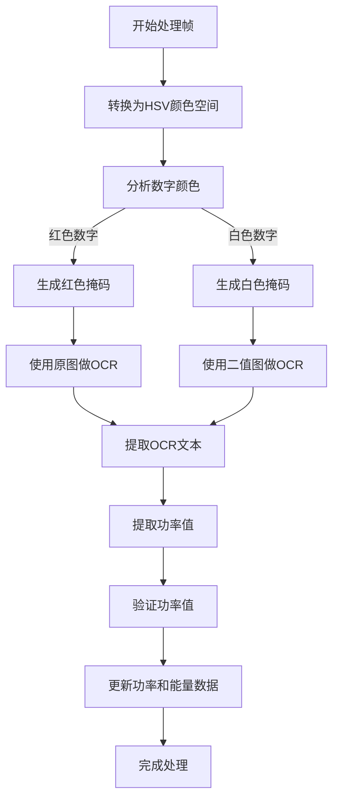

# OCR_robomaster

# PowerOCRApp - 基于视频增强的功率数值OCR工具

## 概述
PowerOCRApp 是一个字符识别 (OCR) 应用程序，专门用于从视频和图像源中提取和分析功率消耗数据。它支持实时视频处理、自定义ROI（兴趣区域）选择和数据可视化，是针对robomaster2025监控功率使用和分析能效的工具。

## 功能特点
- **功率值OCR识别**：利用 PaddleOCR 提取功率消耗值。
- **实时视频处理**：逐帧处理视频流并计算累积能量消耗。
- **自定义ROI选择**：允许用户定义特定区域进行OCR处理。
- **参数配置**：可调节的HSV颜色参数和缩放因子以提升识别效果。
- **数据可视化**：绘制功率和能量趋势图并提供详细统计信息。
- **保存与加载参数**：将自定义配置保存为JSON文件以便复用。
- **保存结果**：将处理后的功率数据导出为CSV文件。

## 安装
### 前置条件
- Python 3.8 或更高版本
- 所需库：
  - `opencv-python`
  - `numpy`
  - `pillow`
  - `matplotlib`
  - `pytesseract`
  - `paddleocr`
  - `tkinter`


## 使用方法

### 功能与控件
1. **打开图像**：加载图像文件进行OCR处理。
2. **打开视频**：加载视频文件进行实时OCR处理。
3. **选择ROI**：定义图像或视频中的特定区域以进行OCR处理。
4. **调整参数**：微调如HSV阈值和缩放因子等参数以提高识别精度。
5. **绘制数据**：可视化功率和能量趋势。
6. **保存数据**：将时间序列功率数据导出为CSV文件。
7. **保存/加载参数**：将参数设置保存为JSON文件或加载之前保存的配置。

### 视频控制
- `⏸ Pause` / `▶ Play`：切换视频暂停或继续。
- `⏮ Start`：回到视频起始位置。
- `⏭ End`：跳转到视频最后一帧。
- `⏪ -100F` / `⏩ +100F`：向后或向前跳跃100帧。

## 示例工作流程
1. 打开一个图像或视频文件。
2. 选择ROI以专注于功率值区域。
3. 如有需要，调整参数以优化OCR识别效果。
4. 处理图像/视频并查看实时OCR结果。
5. 绘制结果以可视化功率和能量趋势。
6. 保存提取的数据以供进一步分析。

# 红色和白色数字的处理逻辑

PowerOCRApp 对于红色和白色数字采用不同的处理方式，以下为详细的处理逻辑说明。

## 处理流程图



## 红色数字处理逻辑

1. **检测红色区域**：
   - 在HSV颜色空间中，根据设定的阈值（`red_hue_low1/high1`）生成红色掩码，并合并为总掩码。

2. **生成红色掩码**：
   - 使用 `cv2.inRange()` 方法生成掩码，保留红色区域。

3. **OCR识别**：
   - 直接对原图进行OCR处理，因为红色数字的背景与数字之间的对比度较高，便于识别。

4. **验证功率值**：
   - 提取的功率值需要符合逻辑范围（例如 0~150W）。
   - 若功率值无效，设置为默认值（如 120W）或使用插值算法计算。

---

## 白色数字处理逻辑

1. **检测白色区域**：
   - 在HSV颜色空间中，根据设定的阈值（`white_sat_high` 和 `white_val_low`）生成白色掩码。

2. **生成白色掩码**：
   - 使用 `cv2.inRange()` 方法生成掩码，保留白色区域。

3. **OCR识别**：
   - 对二值图（白色掩码）进行OCR处理，因为二值图能突出白色数字的轮廓，便于识别。

4. **验证功率值**：
   - 提取的功率值需符合逻辑范围（例如 0~300W）。
   - 若功率值无效，使用插值算法计算功率值。

---

## 关键参数

### 红色数字的HSV阈值
| 参数名称          | 默认值 |
|-------------------|--------|
| `red_hue_low1`    | 0      |
| `red_hue_high1`   | 10     |
| `red_hue_low2`    | 160    |
| `red_hue_high2`   | 179    |
| `red_sat_low`     | 100    |
| `red_sat_high`    | 255    |
| `red_val_low`     | 100    |
| `red_val_high`    | 255    |

### 白色数字的HSV阈值
| 参数名称          | 默认值 |
|-------------------|--------|
| `white_sat_high`  | 83     |
| `white_val_low`   | 151    |

---

## 特殊逻辑

- **红色数字特殊处理**：
  - 若识别到红色数字，但结果不符合逻辑（例如值异常低），程序会自动使用 120W 作为默认值。

- **白色数字特殊处理**：
  - 若识别到白色数字，但结果无效，程序会通过插值算法计算出合理的功率值。

## 注意事项
- 确保您的输入视频/图像包含清晰可见且易于识别的功率数字。
- 调整HSV参数和缩放因子以获得最佳OCR性能。
- 本应用支持红色和白色功率值，并采用不同的识别策略。

## 许可证
本项目基于MIT许可证。

## 联系方式
如有问题或建议，请随时联系：`2581235653@sjtu.edu.cn`
```
